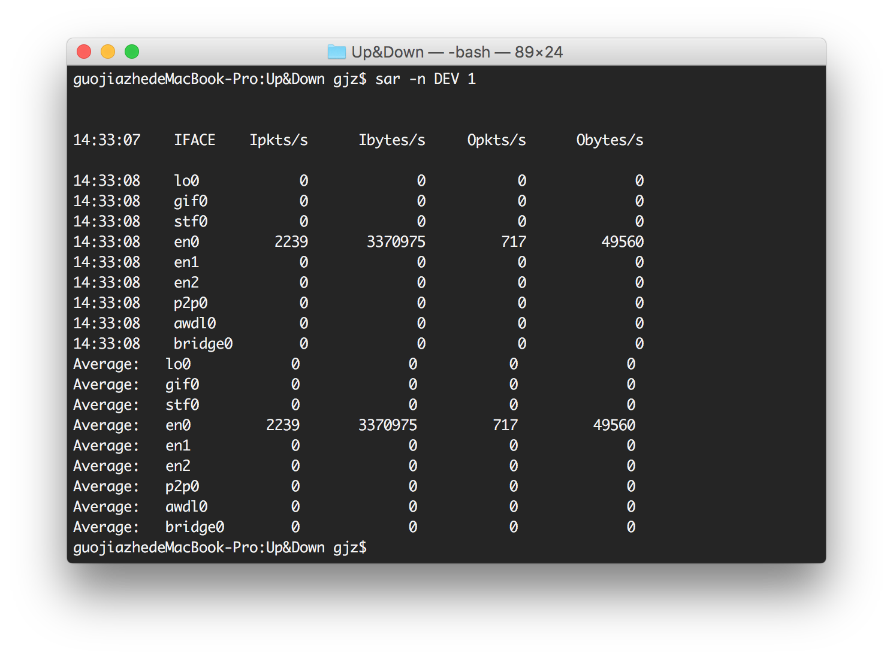

# Up&Down

Up&Down is a menu bar widget for OS X that monitors upload and download speeds.

The app is based on sar, with which you can monitor not only network state but also other various system states, including CPU, memory, device loads, etc.

So actually, you can use sar to create an app like [iStat Menus](https://bjango.com/mac/istatmenus/). But the network is enough for me and I don't want to make the app complicated. If you need other functions, you can fork and add it yourself.

And, this is my first app on OS X, there might be bugs, so pull requests are welcome.